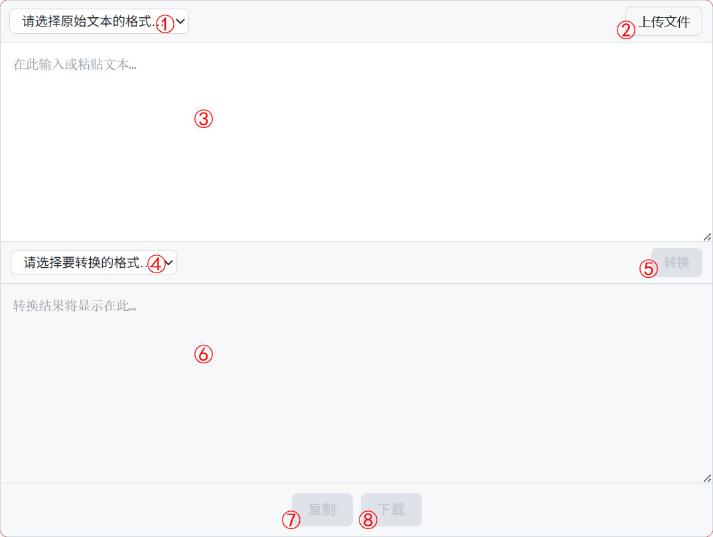

<p align="center">
  
</p>

# 朱码 JS 转换器文档

---

## 目录

1. [项目介绍](#1-项目介绍)
2. [文件结构](#2-文件结构)
3. [无 UI 模式](#3-无-UI-模式)
4. [UI 模式](#4-ui-模式)
6. [转换规则](#5-转换规则)

---

## 1. 项目介绍

[朱码](https://gitee.com/drewneon/drewmark) 是一款受 [Markdown](https://daringfireball.net/projects/markdown/) 和 [Showdown](https://github.com/showdownjs/showdown) 所启发的全功能型标记语言系统。

为了方便习惯使用 Markdown 的用户快速切换至*朱码*，也方便仍未开始使用任何标记语言的用户，特提供基于原生 JavaScript（Vanilla JS）开发的*朱码 JS 转换器*，支持*[朱码](https://gitee.com/drewneon/drewmark)*、[Markdown](https://daringfireball.net/projects/markdown/) 和 HTML 三种格式之间的多种相互转换。

支持的转换方向：

| 源格式 → 目标格式    | 支持状态                       |
| ------------------- | ----------------------------- |
| Markdown → 朱码     | ✅                            |
| HTML → 朱码         | ✅                            |
| 朱码 → Markdown     | ✅                            |
| 朱码 → HTML         | ❌ 请使用 *DrewMark JS 解析器* |
| Markdown → HTML     | ❌ 请使用专门的 Markdown 解析器 |
| HTML → Markdown     | ✅                            |

提供两种使用模式：
- **无 UI 模式** —— 通过在函数中提供必要参数，直接返回转换结果字符串
- **UI 模式** —— 在指定 DOM 元素内渲染可交互的转换器界面，支持文件上传

---

## 2. 文件结构

```javascript
drewmark-js-converter/
├── js/
│   └── drewmark-converter.min.js   主程序
├── css/
│   └── drewmark-converter.min.css  CSS样式
├── lang/
│   ├── en.json                     英文 UI 字符串（供翻译其它语种使用）
│   └── zh-cn.json                  中文 UI 字符串
├── docs/
│   ├── doc.md                      英文文档
│   └── doc-cn.md                   本文档
├── examples/
│   ├── sample.html                 演示页（英文界面）
│   └── sample-cn.html              演示页（中文界面）
├── README.md
└── README-cn.md
```

---

## 3. 无 UI 模式

更适合工程化项目（Node.js + 构建工具），例如使用 Webpack、Vite、Rollup 等构建工具的项目。

### 3.1 使用方法

**1. 安装依赖**

```bash
npm install drewmark-converter
```

**2. 在源码中导入并使用**

在入口文件或组件中导入转换器及样式文件，并调用初始化函数：

```javascript
// 导入转换器
import { drewmarkConverter } from 'drewmark-converter';

const content = '# 标题\n这是一段**朱码**文本。';
const result = drewmarkConverter({
    source_text:   content,
    source_format: 'drewmark',
    target_format: 'markdown',
  }); // 实际值为：'# 标题<br>这是一段**朱码**文本。'

// 将结果渲染到页面或进行后续处理
document.getElementById('output').innerHTML = html;
```

### 3.2 必要参数

无 UI 模式必须提供如下三个必要参数才能返回转换后的字符串。

| 参数名（缩写）           | 含义        | 类型     | 接受值（缩写）                                                  |
| ----------------------- | ---------- | -------- | -------------------------------------------------------------- |
| `source_format`（`sf`） | 原始文本格式 | `string` | `'drewmark'`（`dm`）\| `'markdown'`（`md`）\| `'html'`（`htm`） |
| `target_format`（`tf`） | 转换目标格式 | `string` | `'drewmark'`（`dm`）\| `'markdown'`（`md`）\| `'html'`（`htm`） |
| `source_text`（`st`）   | 原始文本内容 | `string` | 要转换的字符串                                                  |

* 参数名和文本格式都可以使用缩写，例如以下几种写法的功能完全相同：
```javascript
drewmarkConverter({source_format: 'markdown', target_format: 'drewmark`, source_text: '# test'});
drewmarkConverter({source_format: 'md', target_format: 'dm`, source_text: '# test'});
drewmarkConverter({sf: 'markdown', tf: 'drewmark`, st: '# test'});
drewmarkConverter({sf: 'md', tf: 'dm`, st: '# test'});
```

* 特殊情况：如果原始文本格式为*朱码*或 Markdown，转换目标格式为 HTML，转换器不会返回解析结果，而会返回提示：请使用相应的 JS 解析器。

---

## 4. UI 模式

更适合纯 HTML 页面直接调用，无需 Node.js 环境，通过 `<script>` 标签加载后，转换器会以全局变量的形式挂载。

### 4.1 使用方法

**1. 下载依赖**

从本仓库下载 `js/drewmark-converter.min.js`、`css/drewmark-converter.min.css` 和 `lang/zh-cn.json` 至项目目录，如通过 CDN 直接引用则可跳过此步骤。

**2. 引用脚本**

两种方法二选一：

+ 引用下载到本地的脚本：
```html
<head>
  <link rel="stylesheet" href="path/to/drewmark-converter.min.css">
</head>
<script src="path/to/drewmark-converter.min.js"></script>
```

+ 从 CDN 直接引用脚本（跳过下载步骤）：
```html
<head>
  <link rel="stylesheet" href="https://unpkg.com/drewmark-converter@latest/css/drewmark-converter.min.css">
</head>
<script src="https://unpkg.com/drewmark-converter@latest/js/drewmark-converter.min.js"></script>
```

**3. 在指定容器元素中加载转换器**

```html
  <div id="my-converter"></div>
  <script>
    drewmarkConverter({ converter_id: 'my-converter' });
  </script>
```

+ `converter_id` 参数名可缩写为 `cid`，例如上述示例中加载转换器 UI 界面的语句也可以写作：`drewmarkConverter({ cid: 'my-converter' });`。
+ *UI 模式*同样支持*无 UI 模式*的三个参数，并作为初始值加载到 UI 界面中。

### 4.2 界面展示



### 4.3 功能介绍

1. 选择原始文本格式的下拉菜单包含：`朱码(.dm)`、`Markdown(.md)` 和 `HTML(.html)` 三个选项。
2. 点击上传按钮可上传本地 `.dm`、`.md`、`.html`、`.htm` 后缀的文件，自动识别文件格式并读取内容填写到输入框中。
3. 原始文本输入框也支持手动填写内容。
4. 选择要转换的格式的下拉菜单同样包含：`朱码(.dm)`、`Markdown(.md)` 和 `HTML(.html)` 三个选项。当原始文本格式选择*朱码*或 Markdown 时，会自动选择唯一可转换的格式。
5. 转换按钮默认为禁用（灰色），当上述两个下拉菜单（1和4）有了具体选项且原始文本框（3）中有内容时被激活，点击即将转换结果输出到下面的输出框中。
6. 转换结果输出框仅供显示输出结果，不提供编辑修改功能，所以一直保持禁用状态。
7. 复制按钮默认为禁用（灰色），当结果输出框中有内容时激活，点击即可将转换结果复制到剪贴板。
8. 下载按钮默认为禁用（灰色），当结果输出框中有内容时激活，点击即可将转换结果下载到本地，其格式和扩展名由选择的转换格式决定。

---

### 4.4 多语言支持

*朱码 JS 转换器*在加载时会读取 `<html>` 标签的 `lang` 属性值或者浏览器自带的 `navigator.language`，并默认在与 `js` 平级的 `lang` 目录中寻找以此语言为文件名的 `.json` 文件。如果该语言文件存在且包含界面所需的语言条目，则使用该语言加载转换器的界面；如果找不到对应文件名的文件或者该文件内容不符合要求，则使用内置的英文版本加载转换器的界面。本项目的 `lang` 目录中提供了简体中文的语言文件（`zh-cn.json`）以及供翻译用的英文原文（`en.json`）。

如果想对上述多语言的默认状态加以调整，可以使用 `drewmarkConverterLang()` 函数：

**方法一**
1. 使用此函数的 `<script>` 标签须位于 HTML 尾部；
2. `<script>` 标签中须使用 `type="module"` 属性（以便使用 `await`）；
3. 此函数前须使用 `await`；
4. 此函数须写在 `drewmarkConverter()` 函数之前。

```html
......
    <script type="module">
      await drewmarkConverterLang({opts});
      drewmarkConverter({params});
    </script>
  </body>
</html>
```

**方法二**
使用普通 `<script>` 标签（无 `type="module"` 属性），无法使用 `await`，请用 `.then()` 链式调用：

```javascript
drewmarkConverterLang({opts}).then(function () {
  drewmarkConverter({params});
});
```

#### 4.4.1 自定义语言文件路径

**参数名**：`lang_path`（可缩写为`lp`）
**类型**：string
**默认值**：`./lang`
**接受值**：绝对路径或相对路径
**使用方法**：
```javascript
// 方法一
await drewmarkConverterLang({lang_path: '/lang_path'}); // 使用绝对路径
// 方法二
drewmarkConverterLang({lang_path: './lang_path'}).then(function () { // 使用相对路径
  drewmarkConverter({params});
});
```
**说明**：默认情况下，*朱码 JS 转换器*会在与其所在目录平级的 `lang` 目录中寻找语言文件，使用此参数可以指定语言文件存储的目录。
默认情况下，*朱码 JS 转换器*会在与其所在目录平级的 `lang` 目录中寻找语言文件，而 HTML 文件通常在其上级目录中，保持 `lang_path` 的默认值即可找到相应的语言文件。如果项目的目录结构有所不同，使用此参数可以指定语言文件存储的目录。**如通过 CDN 引入 `drewmark-js-editor.min.js`，则须将 `lang_path` 设为 `https://unpkg.com/drewmark-editor@latest/lang`！**

#### 4.4.2 自定义保底语言

**参数名**：`fallback_lang`（可缩写为`fl`）
**类型**：string
**默认值**：`en`
**使用方法**：
```Javascript
// 方法一
await drewmarkConverterLang({fallback_lang: '语言名'}); 
// 方法二
drewmarkConverterLang({fallback_lang: '语言名'}).then(function () {
  drewmarkConverter({params});
});
```
**说明**：默认情况下，*朱码 JS 转换器*在找不到目标语言文件或该文件内容不适用时会以英文作为保底语言，使用此参数可以设置希望的保底语言，但**必须**确保该语言文件内容适用且存在于指定的语言文件目录中，否则转换器仍会以内置的英文版本加载界面。

---

## 5. 转换规则

### 5.1 Markdown → 朱码

*朱码*支持的 HTML 标签覆盖所有 Markdown 所支持的标签，两者完全相同的语法保持不变，下表为两者须转换的不同之处。

| Markdown       | 朱码             | 备注       |
| -------------- | ---------------- | --------- |
| `*斜体*`       | `%%斜体%%`        |           |
| `_斜体_`       | `%%斜体%%`        |           |
| `__粗体__`     | `**粗体**`        |           |
| `[文字](URL)`  | `(文字){URL}`     |           |
| `` | `!(链接){URL}`    |           |
| `\|---\|`      | `\|====\|`       | 表格分隔行 |
| `- [x]`        | `+*+`            | 已完成任务 |
| `- [ ]`        | `-*-`            | 未完成任务 |

### 5.2 朱码 → Markdown

Markdown 支持的 HTML 标签比较有限，遇到超出 Markdown 语法范畴的*朱码*语法时，主要方式是仅保留文本，也会根据具体情况做合理化调整，如下表：

| 朱码                                                   | Markdown                   | 备注                                     |
| ------------------------------------------------------ | ------------------------- | ---------------------------------------- |
| `%%斜体%%`                                             | `*斜体*`                   |                                          |
| `__下划线__`                                           | `下划线`                   | 仅保留文本                                |
| `!!高亮!!`                                             | `高亮`                     | 仅保留文本                                |
| `^^上标^^`                                             | `上标`                     | 仅保留文本                                |
| `<<下标>>`                                             | `下标`                     | 仅保留文本                                |
| `@@小字体@@`                                           | `小字体`                   | 仅保留文本                                 |
| `{{汉字^注音}}`                                        | `汉字(注音)`               | 适当调整格式                               |
| `a. 列表项`<br>`A. 列表项`<br>`i. 列表项`<br>`I. 列表项` | `1. 列表项`                |                                          |
| `+*+ 列表项`                                           | `- [x] 列表项`             |                                           |
| `-*- 列表项`                                           | `- [ ] 列表项`             |                                           |
| `\|====\|`                                             | `\|---\|`                 | 表格分隔行须转换，且仅保留第一个             |
| `(文字){URL}`                                          | `[文字](URL)`              |                                           |
| `!(链接){URL}`                                         | ``             |                                           |
| `!!!`<br>`! 图片标题`<br>`!(alt){src}`<br>`!!!`        | `图片标题`<br>`` | 仅保留图片标题和图片                       |
| `~(){URL\|mpeg}`<br>`$(){URL\|mpeg}`                  | `[mpeg](URL)`              | 以媒体类型为标题的链接                     |
| `;;术语::定义;;`                                       | `**术语**: 定义`            | 适当调整格式                              |
| `;;; 标题`<br>`内容`<br>`;;;`                          | `**标题**`<br>`  内容`      | 适当调整格式                               |
| `>>引文<<`                                             | `"引文"`                    | 虽无法解析为 `<q>` 标签，但显示效果基本一致 |
| `((数值//总额))`                                       | `(数值/总额)`               | 适当调整格式                               |
| `{{{ CSS }}}`                                         | `null`                      | 样式块移除                                |

### 5.3 HTML → 朱码

此转换功能更适合用于转换由博客系统生成的博文部分。

1. *朱码*支持的所有元素和属性都会被转换。
2. 分节内容元素（`<div>`、`<section>`、`<article>`、`<main>`、`<aside>`、`<header>`、`<footer>`、`<nav>`等）：如果包含直接文本，则保留文本并在文本结尾处附加对应标签中的全局属性；否则将直接移除标签及所含全局属性。
3. 无特殊呈现的行内元素（`<span>`）：只保留内部文本，并直接移除标签及所含全局属性。
4. 表单和脚本类元素（`<input>`、`<button>`、`<select>`、`<textarea>`、`<script>`等）：直接移除标签、所含全局属性以及内部文本。
5. 样式元素 `<style>` 和样式属性 ` style=""` 被解析为*朱码*对应的语法，在使用*朱码 JS 解析器*默认忽略这些语法，可以使用参数复现。
6. 字符型表情符号以文本形式原样保留。

### 5.4 HTML → Markdown

通过两步实现：先将 HTML 格式转换为*朱码*格式，再将*朱码*格式转换为 Markdown 格式。

---

*版本: v1.1.6*