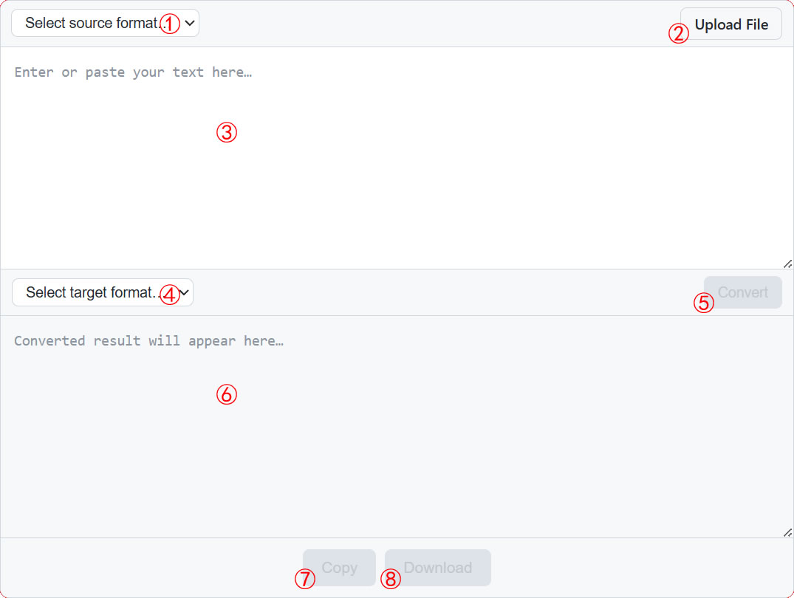

<p align="center">
  
</p>

# DrewMark JS Converter Documentation

---

## Table of Contents

1. [Project Introduction](#1-project-introduction)
2. [File Structure](#2-file-structure)
3. [Headless Mode](#3-headless-mode)
4. [UI Mode](#4-ui-mode)
5. [Conversion Rules](#5-conversion-rules)

---

## 1. Project Introduction

[DrewMark](https://github.com/drewneon/drewmark) is a full-featured markup language system inspired by [Markdown](https://daringfireball.net/projects/markdown/) and [Showdown](https://github.com/showdownjs/showdown).

To facilitate a quick transition for users accustomed to Markdown, as well as to assist those who have not yet adopted any markup language,  *DrewMark JS Converter* is provided. Developed with Vanilla JavaScript, the Converter is capable of various conversion among [DrewMark](https://github.com/drewneon/drewmark), [Markdown](https://daringfireball.net/projects/markdown/), and HTML.

Supported Conversion Directions:

| Source → Target       | Status                                    |
| --------------------- | ----------------------------------------- |
| Markdown → DrewMark   | ✅                                        |
| HTML → DrewMark       | ✅                                        |
| DrewMark → Markdown   | ✅                                        |
| DrewMark → HTML       | ❌ Please use *DrewMark JS Parser*        |
| Markdown → HTML       | ❌ Please use a dedicated Markdown parser |
| HTML → Markdown       | ✅                                        |

Two usage modes are available:
- **Headless Mode** — Returns the converted string directly by providing the necessary parameters to the main function.
- **UI Mode** — Renders an interactive converter interface into a specified DOM element, supporting file uploads.

---

## 2. File Structure

```javascript
drewmark-js-converter/
├── js/
│   └── drewmark-converter.min.js   Main program
├── css/
│   └── drewmark-converter.min.css  CSS styles
├── lang/
│   ├── en.json                     English UI strings (for translating into other languages)
│   └── zh-cn.json                  Chinese UI strings
├── docs/
│   ├── doc.md                      This documentation
│   └── doc-cn.md                   Chinese document
├── examples/
│   ├── sample.html                 Demo page (English interface)
│   └── sample-cn.html              Demo page (Chinese interface)
├── README.md
└── README-cn.md

```

---

## 3. Headless Mode

More suitable for Bundled Projects (Node.js + Build Tools), i.e. projects using build tools such as Webpack, Vite, or Rollup.

### 3.1 Usage

**1. Install Dependencies**

```bash
npm install drewmark-converter
```

**2. Import and Use in Source Code**

Import the Converter and its stylesheet in your entry file or component, then call the initialization function:

```javascript
// Import the Converter
import { drewmarkConverter } from 'drewmark-converter';

const content = '# Heading\nThis is a **DrewMark** text.';
const result = drewmarkConverter({
    source_text:   content,
    source_format: 'drewmark',
    target_format: 'markdown',
  }); // the actuall value is '# Heading<br>This is a **DrewMark** text.'

// Render the result to the page or process it further
document.getElementById('output').innerHTML = html;

```

### 3.2 Required Parameters

The following three parameters are required in Headless Mode to return the converted string.

| Parameter (Abbreviation)      | Description         | Type     | Accepted Values (Abbreviations)                                |
| ----------------------------- | ------------------- | -------- | -------------------------------------------------------------- |
| `source_format` (`sf`)        | Source text format  | `string` | `'drewmark'` (`dm`) \| `'markdown'` (`md`) \| `'html'` (`htm`) |
| `target_format` (`tf`)        | Target text format  | `string` | `'drewmark'` (`dm`) \| `'markdown'` (`md`) \| `'html'` (`htm`) |
| `source_text` (`st`)          | Source text content | `string` | The string to be converted                                     |

* Both parameter names and values support abbreviations. For example, the following calls are functionally identical:

```javascript
drewmarkConverter({source_format: 'markdown', target_format: 'drewmark', source_text: '# test'});
drewmarkConverter({source_format: 'md', target_format: 'dm', source_text: '# test'});
drewmarkConverter({sf: 'markdown', tf: 'drewmark', st: '# test'});
drewmarkConverter({sf: 'md', tf: 'dm', st: '# test'});

```

* Special Case: If the source format is DrewMark or Markdown and the target format is HTML, the Converter will not return parsed HTML. Instead, it will return a message prompting you to use the corresponding JS parser.

---

## 4. UI Mode

More suitable for plain HTML pages without a Node.js environment. When loaded via a `<script>` tag, the Converter will be mounted as a global variable.

### 4.1 Usage

**1. Download Library**

Download `js/drewmark-converter.min.js` and `css/drewmark-converter.min.css` from this repository into your project directory. You may skip this step if referencing directly via CDN.

**2. Include Scripts**

Choose one of the following two methods:

+ Reference the locally downloaded scripts:
```html
<head>
  <link rel="stylesheet" href="path/to/drewmark-converter.min.css">
</head>
<script src="path/to/drewmark-converter.min.js"></script>
```

+ Reference scripts directly from CDN (skips the download step):
```html
<head>
  <link rel="stylesheet" href="https://unpkg.com/drewmark-converter@latest/css/drewmark-converter.min.css">
</head>
<script src="https://unpkg.com/drewmark-converter@latest/js/drewmark-converter.min.js"></script>
```

**3. Load the Converter in the Specified Container Element**

```html
  <div id="my-converter"></div>
  <script>
    drewmarkConverter({ converter_id: 'my-converter' });
  </script>
```

+ The `converter_id` parameter can be abbreviated as `cid`. For example, the statement to load the Converter UI in the above example can also be written as: `drewmarkConverter({ cid: 'my-converter' });`.
+ *UI Mode* also supports the three parameters detailed in *Headless Mode* section, and their values are used as the initial values when the Converter's UI is loaded.

### 4.2 Interface Showcase



### 4.3 Feature Overview

1. The source format dropdown menu contains three options: `DrewMark (.dm)`, `Markdown (.md)`, and `HTML (.html)`.
2. Clicking the upload button allows you to upload local files with `.dm`, `.md`, `.html`, or `.htm` extensions. The file format is automatically detected, and its content is read and populated into the input box.
3. The source text input box also supports manual content entry.
4. The target format dropdown menu also contains three options: `DrewMark (.dm)`, `Markdown (.md)`, and `HTML (.html)`. When DrewMark or Markdown is selected as the source format, the only available target format will be automatically selected.
5. The Convert button is disabled (grayed out) by default. It becomes active when both dropdown menus (1 and 4) are selected and there is content in the source text box (3). By clicking this button, the conversion result will be presented in the output box below.
6. The result output box is for display purposes only and does not support editing; therefore, it remains disabled at all times.
7. The Copy button is disabled (grayed out) by default. It becomes active when there is content in the result output box. By clicking this button, the conversion result will be copied to the clipboard.
8. The Download button is disabled (grayed out) by default. It becomes active when there is content in the result output box. By clicking this button, the conversion result will be downloaded locally, the format and file extension determined by the selected target format.

---

### 4.4 Multilingual Support

On load, DrewMark JS Converter reads the `lang` attribute value of the `<html>` tag or `navigator.lanugage` provided by the browser, and searches for a `.json` file named accordingly in the `lang` directory (sibling to `js`). If the language file exists and contains required UI entries, the Converter loads with that language. If no matching file is found or its content is invalid, the built-in English version is used. The project's `lang` directory includes an English source file (`en.json`) for translation purposes.

To modify the default multi-language behavior, use the `drewmarkConverterLang()` function:

**Method I**
1. The `<script>` tag invoking this function must be placed at the end of the HTML body;
2. The `<script>` tag must include the `type="module"` attribute;
3. The function call must be preceded by `await`;
4. This function must be called before `drewmarkConverter()`.

```html
......
    <script type="module">
      await drewmarkConverterLang({opts});
      drewmarkConverter({params});
    </script>
  </body>
</html>
```

**Method II**
In normal `<script>` tag without `type="module"` attribute, `await` will not work, please use `.then()`.

```javascript
drewmarkConverterLang({opts}).then(function () {
  drewmarkConverter({params});
});
```

#### 4.4.1 Custom Language File Path

**Parameter Name**: `lang_path` (or abbreviated as `lp`)
**Type**: string
**Default Value**: `./lang`
**Accepted Values**: absolute path or relative path
**Usage**:
```javascript
// Method I
await drewmarkConverterLang({lang_path: '/lang_path'});  // use absolute path
// Method II
drewmarkConverterLang({./lang_path}).then(function () { // use relative path
  drewmarkConverter({params});
});
```
**Description**: By default, DrewMark JS Converter looks for language files in the `lang` directory sibling to its own location, and HTML files are normally resided in the upper directory, hence the language files are found by keeping this parameter to its default value. However, if the directory structure is different from this, please use this parameter to specify a custom directory for the language files. **If `drewmark-js-editor.min.js` is included via CDN, `lang_path` must be set to `https://unpkg.com/drewmark-editor@latest/lang`!**

#### 4.4.2 Custom Fallback Language

**Parameter Name**: `fallback_lang` (or abbreviated as `fl`)
**Type**: string
**Default Value**: `en`
**Usage**:
```Javascript
// Method I
await drewmarkConverterLang({fallback_lang: 'language_name'}); 
// Method II
drewmarkConverterLang({fallback_lang: 'language_name'}).then(function () {
  drewmarkConverter({params});
});
```
**Description**: By default, if the target language file is missing or invalid, DrewMark JS Converter falls back to English. Use this parameter to set a preferred fallback language. However, you **must** ensure that the specified language file exists in the designated language file directory and contains valid content; otherwise, the Converter will still load with the built-in English interface.

---

## 5. Conversion Rules

### 5.1 Markdown → DrewMark

The HTML tags supported by DrewMark cover all those supported by Markdown. Syntax that is identical in both of these two markup languages remains unchanged. The table below lists the differences that require conversion.

| Markdown       | DrewMark         | Notes                  |
| -------------- | ---------------- | ---------------------- |
| `*Italic*`     | `%%Italic%%`     |                        |
| `_Italic_`     | `%%Italic%%`     |                        |
| `__Bold__`     | `**Bold**`       |                        |
| `[Text](URL)`  | `(Text){URL}`    |                        |
| `` | `!(Link){URL}`   |                        |
| `\|---\|`      | `\|====\|`       | Table separator row    |
| `- [x]`        | `+*+`            | Completed task         |
| `- [ ]`        | `-*-`            | Incomplete task        |

### 5.2 DrewMark → Markdown

Markdown supports a limited set of HTML tags. When encountering DrewMark syntax that falls outside the scope of Markdown, the primary approach is to retain only the text content. Reasonable adjustments are also made depending on the specific context, as shown in the table below:

| DrewMark                                                             | Markdown                       | Notes                                                                |
| -------------------------------------------------------------------- | ------------------------------ | -------------------------------------------------------------------- |
| `%%Italic%%`                                                         | `*Italic*`                     |                                                                      |
| `__Underline__`                                                      | `Underline`                    | Text only                                                            |
| `!!Highlight!!`                                                      | `Highlight`                    | Text only                                                            |
| `^^Superscript^^`                                                    | `Superscript`                  | Text only                                                            |
| `<<Subscript>>`                                                      | `Subscript`                    | Text only                                                            |
| `@@Small Font@@`                                                     | `Small Font`                   | Text only                                                            |
| `{{Character^Annotation}}`                                           | `Character(Annotation)`        | Format adjusted appropriately                                        |
| `a. List item`<br>`A. List item`<br>`i. List item`<br>`I. List item` | `1. List item`                 |                                                                      |
| `+*+ List item`                                                      | `- [x] List item`              |                                                                      |
| `-*- List item`                                                      | `- [ ] List item`              |                                                                      |
| `\|====\|`                                                           | `\|---\|`                      | Table separator rows is converted and only the first one is retained |
| `(Text){URL}`                                                        | `[Text](URL)`                  |                                                                      |
| `!(Link){URL}`                                                       | ``                 |                                                                      |
| `!!!`<br>`! Image Title`<br>`!(alt){src}`<br>`!!!`                   | `Image Title`<br>`` | Only image title and the images are retained                         |
| `~(){URL\|mpeg}`<br>`$(){URL\|mpeg}`                                 | `[mpeg](URL)`                  | Convert to links with media type as their alt                        |
| `;;Term::Definition;;`                                               | `**Term**: Definition`         | Format adjusted appropriately                                        |
| `;;; Title`<br>`Content`<br>`;;;`                                    | `**Title**`<br>`  Content`     | Format adjusted appropriately                                        |
| `>>Quote<<`                                                          | `"Quote"`                      | Cannot be parsed as `<q>` tag, but visually similar                  |
| `((Value//Total))`                                                   | `(Value/Total)`                | Format adjusted appropriately                                        |
| `{{{ CSS }}}`                                                        | `null`                         | Style block removed                                                  |

### 5.3 HTML → DrewMark

This conversion feature is particularly well-suited for converting blog post content generated by blogging systems.

1. All elements and attributes supported by DrewMark will be converted.
2. Sectioning content elements (`<div>`, `<section>`, `<article>`, `<main>`, `<aside>`, `<header>`, `<footer>`, `<nav>`, etc.): If they contain direct text, the text is retained and global attributes from the corresponding tag are appended at the end of the text; otherwise, the tag and its global attributes are removed entirely.
3. Inline elements without special presentation (`<span>`): Only the inner text is retained; the tag and its global attributes are removed directly.
4. Form and script elements (`<input>`, `<button>`, `<select>`, `<textarea>`, `<script>`, etc.): The tag, its global attributes, and inner text are all removed directly.
5. The `<style>` element and the `style=""` attribute are parsed into corresponding DrewMark syntax. These are ignored by default when using the DrewMark JS Parser but can be reproduced via parameters.
6. Character-based emojis are preserved as-is in text form.

### 5.4 HTML → Markdown

This is achieved in two steps: HTML → DrewMark, then DrewMark → Markdown.

---

*Version: v1.1.6*